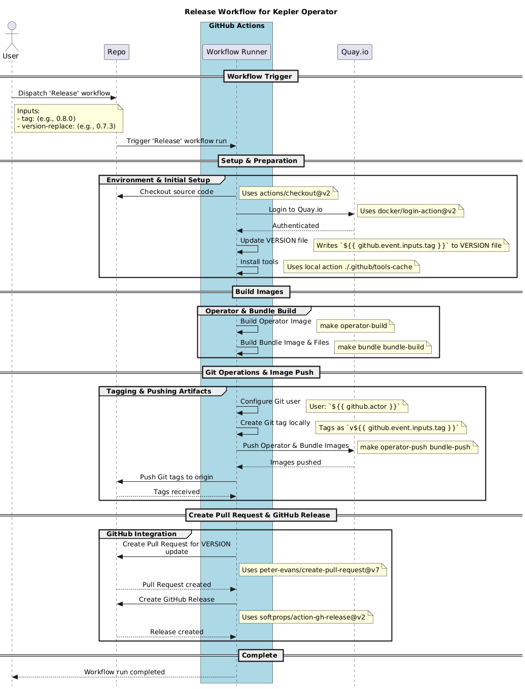

# 🚀 Kepler Operator Release Process

This document outlines the automated release workflow for Kepler Operator.

## 📋 Release Workflow Overview

The release process for Kepler Operator is automated through GitHub Actions. When triggered, it handles version updates, image building, and publishing of artifacts.

## ⚠️ Important Notes

- Ensure you have proper permissions to trigger the release workflow
- Double-check the new version and which old operator version to be replaced before triggering the release
- Images are pushed to Quay.io registry, ensure credentials are properly configured in GitHub Secrets
- After release, verify that:
  - Images are available in the registry
  - GitHub Release is created with proper tags
  - Pull Request for version and bundle updates is created and merged

