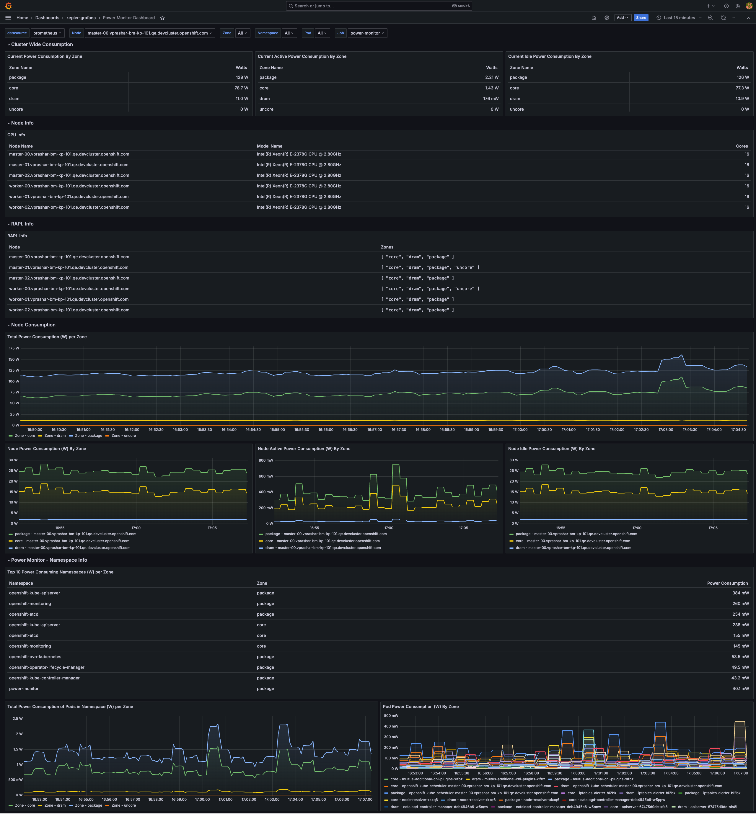

# Grafana Deployment Overview

To deploy grafana, run the following command

```bash
hack/dashboard/openshift/deploy-grafana.sh
```

Running the above should get you a dashboard as follows


Details instructions for deploying Grafana Dashboard can be found [here](https://sustainable-computing.io/installation/community-operator/#installing-kepler-demo-dashboard)

The overview of the deployment looks as follows 


