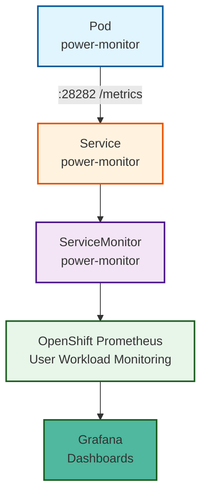

# Setting up Grafana Dashboards

This guide explains how to set up Grafana dashboards to visualize Kepler energy metrics.

## Overview

Kepler exports energy consumption metrics in Prometheus format. Grafana dashboards provide visual representations of:

- Node-level power consumption
- Pod energy usage by namespace
- Container energy metrics
- Historical energy trends

## Choose Your Platform

The setup process differs significantly between platforms. Select your platform below:

- **[OpenShift](#openshift)** - Automated setup with built-in monitoring (recommended for OpenShift users)
- **[Kubernetes](#kubernetes)** - Manual setup with kube-prometheus-stack

---

## OpenShift

OpenShift includes a built-in monitoring stack with Prometheus. Use the automated deployment script to set up Grafana and dashboards.

### Prerequisites

- OpenShift cluster (4.12 or higher)
- PowerMonitor deployed and running
- Access to create resources in monitoring namespaces

### Deploy Grafana

Kepler Operator includes a deployment script that automates the entire setup:

```bash
# Clone the repository (if not already done)
git clone https://github.com/sustainable-computing-io/kepler-operator.git
cd kepler-operator

# Run the Grafana deployment script
./hack/dashboard/openshift/deploy-grafana.sh
```

The script automatically:

1. Enables User Workload Monitoring (if not already enabled)
2. Creates a Grafana instance in the `kepler-grafana` namespace
3. Configures Grafana to use OpenShift's Prometheus as a datasource
4. Imports Kepler and Prometheus dashboards
5. Sets up necessary RBAC permissions

### Access Grafana

The deployment script prints the Grafana dashboard URL and login credentials when it completes. Look for this output:

```text
📈 Grafana Configuration:

     Dashboard URL: https://kepler-grafana-route-kepler-grafana.apps.example.com/login
             Admin: kepler
          Password: kepler
```

To access Grafana:

1. Open the Dashboard URL from the script output in your browser
2. Login with the credentials shown in the script output
3. Navigate to **Dashboards** to view Kepler metrics

### Architecture

Kepler integrates with OpenShift's monitoring stack through ServiceMonitor resources:



For architecture details, see the [Grafana Deployment Overview](../../developer/grafana-deployment-overview.md).

### Verify User Workload Monitoring

The deployment script automatically enables User Workload Monitoring. To verify it's running:

```bash
oc get pods -n openshift-user-workload-monitoring
```

You should see Prometheus pods in a Running state.

### OpenShift Troubleshooting

If dashboards show no data:

1. **Verify PowerMonitor is running**:

   ```bash
   oc get powermonitor power-monitor
   oc get pods -n power-monitor
   ```

2. **Check Prometheus targets**:

   Access OpenShift Console → Observe → Targets → Filter for "power-monitor"

3. **Verify ServiceMonitor**:

   ```bash
   oc get servicemonitor power-monitor -n power-monitor
   oc describe servicemonitor power-monitor -n power-monitor
   ```

For more troubleshooting, see the [Troubleshooting Guide](./troubleshooting.md#openshift).

---

## Kubernetes

Vanilla Kubernetes requires manual setup of Prometheus and Grafana. These instructions cover the **kube-prometheus-stack** approach, which provides Grafana with automatic dashboard provisioning.

### Prerequisites

Before setting up Grafana dashboards, ensure you have:

1. **Monitoring stack installed**:
   - **Prometheus with prometheus-operator** (required)
   - **Grafana** (required for dashboards)

   See the **[Monitoring Stack Setup Guide](../installation/monitoring-stack-kubernetes.md)** for installation instructions

2. **PowerMonitor deployed** with ServiceMonitor enabled:

   ```bash
   helm install kepler-operator ./manifests/helm/kepler-operator \
     --namespace kepler-operator \
     --create-namespace \
     --set metrics.serviceMonitor.enabled=true
   ```

3. **Prometheus scraping Kepler metrics** (verify in next step)

### Verify Prometheus Integration

Check that Prometheus is scraping Kepler metrics:

```bash
# Port-forward to Prometheus
kubectl port-forward -n monitoring svc/prometheus-kube-prometheus-prometheus 9090:9090
```

1. Open <http://localhost:9090> in your browser
2. Navigate to **Status** → **Targets**
3. Look for `power-monitor` targets - they should show state "UP"

Alternatively, query for Kepler metrics:

```promql
kepler_node_cpu_joules_total
```

If metrics appear, Prometheus is successfully scraping Kepler.

### Import Dashboards

#### Option 1: Manual Import via Grafana UI

1. Access Grafana (typically <http://localhost:3000>)
2. Navigate to **Dashboards** → **Import**
3. Upload dashboard JSON files:
   - [Kepler Dashboard](https://raw.githubusercontent.com/sustainable-computing-io/kepler-operator/main/hack/dashboard/assets/kepler/dashboard.json)
   - [Prometheus Dashboard](https://raw.githubusercontent.com/sustainable-computing-io/kepler-operator/main/hack/dashboard/assets/prometheus/dashboard.json)
4. Select your Prometheus datasource
5. Click **Import**

#### Option 2: Automated Import (kube-prometheus-stack only)

This method uses the dashboard sidecar container that automatically loads dashboards from ConfigMaps labeled with `grafana_dashboard=1`.

##### Method A: Using Local Repository Files

```bash
# Kepler dashboard
kubectl create configmap kepler-dashboard \
  --from-file=dashboard.json=./hack/dashboard/assets/kepler/dashboard.json \
  -n monitoring
kubectl label configmap kepler-dashboard grafana_dashboard=1 -n monitoring

# Prometheus dashboard
kubectl create configmap prometheus-dashboard \
  --from-file=dashboard.json=./hack/dashboard/assets/prometheus/dashboard.json \
  -n monitoring
kubectl label configmap prometheus-dashboard grafana_dashboard=1 -n monitoring
```

##### Method B: Download from GitHub

```bash
# Download dashboard files
curl -o kepler-dashboard.json \
  https://raw.githubusercontent.com/sustainable-computing-io/kepler-operator/main/hack/dashboard/assets/kepler/dashboard.json
curl -o prometheus-dashboard.json \
  https://raw.githubusercontent.com/sustainable-computing-io/kepler-operator/main/hack/dashboard/assets/prometheus/dashboard.json

# Create ConfigMaps
kubectl create configmap kepler-dashboard \
  --from-file=dashboard.json=kepler-dashboard.json \
  -n monitoring
kubectl label configmap kepler-dashboard grafana_dashboard=1 -n monitoring

kubectl create configmap prometheus-dashboard \
  --from-file=dashboard.json=prometheus-dashboard.json \
  -n monitoring
kubectl label configmap prometheus-dashboard grafana_dashboard=1 -n monitoring

# Cleanup downloaded files
rm kepler-dashboard.json prometheus-dashboard.json
```

The dashboard sidecar will automatically detect and load the dashboards within 30-60 seconds.

**Verify Import**:

```bash
kubectl logs -n monitoring deployment/prometheus-grafana -c grafana-sc-dashboard --tail=20
```

You should see log entries like:

```json
{"level": "INFO", "msg": "Writing /tmp/dashboards/dashboard.json (ascii)"}
{"level": "INFO", "msg": "Dashboards config reloaded"}
```

### Access Grafana

When using kube-prometheus-stack, Grafana is automatically installed and configured.

**Get Admin Credentials**:

```bash
# Username is: admin
# Get password:
kubectl get secret -n monitoring prometheus-grafana \
  -o jsonpath="{.data.admin-password}" | base64 -d && echo
```

**Access Grafana UI**:

1. **Local access** (from the same machine running kubectl):

   ```bash
   kubectl port-forward -n monitoring svc/prometheus-grafana 3000:80
   ```

   Open <http://localhost:3000> in your browser.

2. **Remote access** (from another machine):

   ```bash
   kubectl port-forward -n monitoring svc/prometheus-grafana 3000:80 --address=0.0.0.0
   ```

   Open `http://<your-host-ip>:3000` in your browser.

3. **Production access**: Configure an Ingress resource to expose Grafana with TLS and authentication.

Login with the admin credentials retrieved above.

### Verify Prometheus Datasource

The Prometheus datasource should be automatically configured. To verify:

1. Access Grafana
2. Navigate to **Configuration** → **Data Sources**
3. Look for **Prometheus** datasource
4. Click on it and verify:
   - **URL**: `http://prometheus-kube-prometheus-prometheus.monitoring:9090/`
   - Status shows green with "Data source is working"

**If you need to configure manually**:

1. Navigate to **Configuration** → **Data Sources**
2. Click **Add data source** → Select **Prometheus**
3. Configure:
   - **Name**: `Prometheus`
   - **URL**: `http://prometheus-operated.monitoring.svc:9090` (adjust namespace if needed)
   - **Access**: `Server (default)`
4. Click **Save & Test**

### Kubernetes Troubleshooting

If dashboards show no data:

1. **Verify Kepler is running**:

   ```bash
   kubectl get pods -A -l app.kubernetes.io/name=power-monitor-exporter
   ```

2. **Check Prometheus targets**:
   - Access Prometheus UI at <http://localhost:9090>
   - Navigate to **Status** → **Targets**
   - Verify `power-monitor` targets are "UP"

3. **Query metrics directly**:

   ```bash
   kubectl port-forward -n power-monitor daemonset/power-monitor 28282:28282
   curl http://localhost:28282/metrics | grep kepler
   ```

4. **Check ServiceMonitor**:

   ```bash
   kubectl get servicemonitor -A | grep power-monitor
   kubectl describe servicemonitor power-monitor -n power-monitor
   ```

For more troubleshooting, see the [Troubleshooting Guide](./troubleshooting.md#kubernetes).

---

## Additional Resources

- **[Kepler Metrics Documentation](https://sustainable-computing.io/kepler/design/metrics/)** - Complete list of Kepler metrics

## Next Steps

- **[PowerMonitor Configuration](./power-monitor.md)** - Configure PowerMonitor resources
- **[Troubleshooting](./troubleshooting.md)** - Diagnose common issues
- **[Validating Prometheus Integration](./validating-prometheus-integration.md)** - Deep dive into Prometheus setup
